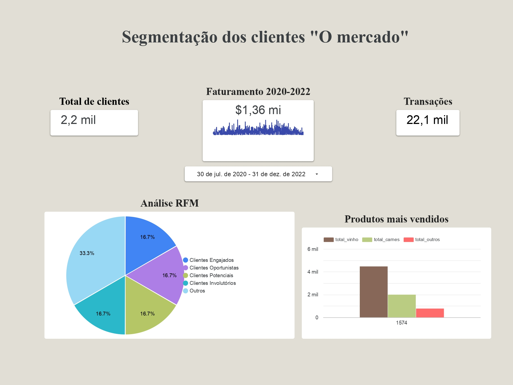

# Segmentação de Clientes – Análise RFM

Este projeto tem como objetivo segmentar a base de clientes de uma empresa fictícia chamada "O Mercado", utilizando a metodologia RFM (Recência, Frequência e Valor Monetário). A análise permite identificar perfis de clientes estratégicos e apoiar a tomada de decisão em campanhas de marketing e fidelização.

---

## Ficha Técnica

| Item                   | Descrição |
|------------------------|-----------|
| **Período analisado**  | Julho/2020 a Dezembro/2022 |
| **Número de clientes** | 2.200 |
| **Número de transações** | 22.100 |
| **Faturamento total**  | R$ 1,36 milhão |
| **Ferramentas utilizadas** | Google Sheets, BigQuery (SQL), Looker Studio |
| **Técnicas aplicadas** | RFM Analysis, Classificação de Clientes, Agrupamento Estratégico, Visualização de Dados |
| **Categorias RFM criadas** | Engajados, Oportunistas, Potenciais, Involutórios, Outros |

---

## Objetivos do Projeto

- Identificar os melhores clientes com base em comportamento de compra.
- Criar categorias estratégicas para ações personalizadas de retenção.
- Visualizar padrões de compra e produtos mais vendidos.
- Auxiliar gestores com insights baseados em dados históricos.

---

## Visualização do Dashboard

---

## Principais Insights

- Os clientes engajados representam uma parte significativa da receita.
- Vinho é o produto mais vendido, com alta frequência de compra.
- Há espaço para reativar clientes involutórios com campanhas direcionadas.

---

## Próximos Passos

- Aprofundar análise por região e faixa etária.
- Criar um modelo preditivo de abandono com base em RFM.
- Aplicar a metodologia em bases reais com maior granularidade.

---

## Contato

Gabriela Albuquerque  
[LinkedIn](https://www.linkedin.com/in/gabriela-cdeallbuquerque/) | [Portfólio](https://github.com/gabrielacalbuquerque)

